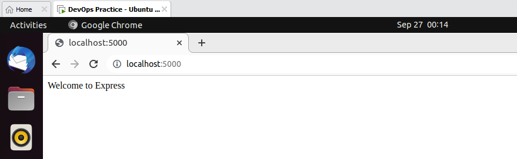

## MERN STACK IMPLEMENTATION
To ensure a successful completion of this project, here are some prerequisites:
- Have VS Code and some of it's extensions installed.
- Install VMware and create an Ubuntu (v22.04) linux virtual machine 
- Create a GitHub account and create a personal access token (PAT)
- Create OpenSSH key pair in your local system and use the public key to create SSH key in GitHub

Below are the steps I followed to implement a MERN STACK for a Todo application that uses a RESTful API.

### 1.  Configure Backend
I followed the steps below to configure the backend

- Install Node.js and NPM
To install nodejs and npm and download the necessary package repository, I had to update the apt packages
```
# update ubuntu
sudo apt update -y

# upgrade ubuntu
sudo apt upgrade

# get the location of Node.js software from Ubuntu repositories
curl -fsSL https://deb.nodesource.com/setup_18.x | sudo -E bash -

# install nodejs on the server
sudo apt install nodejs -y 

# confirm that Node.js and NPM are both installed
node -v
npm -v
```

- Setup for Application code
```
#create a new directory for the application project
mkdir ToDo

#confirm the directory is created
ls -lih

#change directory to the newly created one
cd ToDo

# initialize the project to create the package.json file
npm init
```

***Result Screenshot:***
<br />


### 2.  Install ExpressJS Server
I followed the steps below to install and configure ExpressJS:

- use npm package installer to install ExpressJS
```
npm install express
```

- create a file index.js
```
touch index.js
```

- Install dotenv module using npm
```
npm install dotenv
```

- Open the index.js file with the command `vi index.js`, paste the code below, save, and close.
```
const express = require('express');
require('dotenv').config();

const app = express();

const port = process.env.PORT || 5000;

app.use((req, res, next) => {
res.header("Access-Control-Allow-Origin", "\*");
res.header("Access-Control-Allow-Headers", "Origin, X-Requested-With, Content-Type, Accept");
next();
});

app.use((req, res, next) => {
res.send('Welcome to Express');
});

app.listen(port, () => {
console.log(`Server running on port ${port}`)
});
```

- Start the server to confirm if it was properly configured.
```
node index.js
```

***Result Screenshot:***
<br />


***Result Screenshot:***
<br />


- Access the server from a browser using the server's IP Address and the port 5000.
```
http://localhost:5000
```
***Result Screenshot:***
<br />


- Create routes that will define different endpoints that the ToDo app will depend on.
The ToDo app should be able to perform the following actions: create tasks, display tasks' list, and delete completed task. Hence, we need to create routes for those distinct actions, as they will use different standard HTTP request methods: POST, GET, DELETE.

```
# create a directory called routes
mkdir routes

# change to the routes directory
cd routes

# create and open a file api.js
vi api.js

# copy the code below into the file, save and close.
const express = require ('express');
const router = express.Router();

router.get('/todos', (req, res, next) => {

});

router.post('/todos', (req, res, next) => {

});

router.delete('/todos/:id', (req, res, next) => {

})

module.exports = router;
```

### 3.  Create a Model
We need to create a model to make our application interactive and to define our database schema, since we are using Mongodb

- Install mongoose package to create a Schema and a model
```
# change to the ToDo directory
cd ..

# use npm to install mongoose
npm install mongoose
```

- Create a directory called models, change to that directory, create and open the file todo.js
```
mkdir models && cd models && vi todo.js
```

- Copy and paste the code below into the file, save, and close
```
const mongoose = require('mongoose');
const Schema = mongoose.Schema;

// create schema for todo
const TodoSchema = new Schema({
    action: {
        type: String,
        required: [true, 'The todo text field is required']
    }
})

// create model for todo
const Todo = mongoose.model('todo', TodoSchema);

module.exports = Todo;
```

- Update our routes from the file api.js in ‘routes’ directory to make use of the new model
```
# change to the routes directory
cd ../routes

# open the api.js file with `vi api.js` and delete the code inside with `:%d`. Then paste the code below into the file, save, and close
const express = require ('express');
const router = express.Router();
const Todo = require('../models/todo');

router.get('/todos', (req, res, next) => {

// this will return all the data, exposing only the id and action field to the client
    Todo.find({}, 'action')
    .then(data => res.json(data))
    .catch(next)
});

router.post('/todos', (req, res, next) => {
    if(req.body.action){
        Todo.create(req.body)
        .then(data => res.json(data))
        .catch(next)
    }
    else {
        res.json({
            error: "The input field is empty"
        })
    }
});

router.delete('/todos/:id', (req, res, next) => {
    Todo.findOneAndDelete({"_id": req.params.id})
    .then(data => res.json(data))
    .catch(next)
})

module.exports = router;
```

### 4.  Create a MongoDB Database
**a. Create a MongoDB database on mLab platform by signing up for a cluster shared free account.**

- Create an account on navigating to the [link](https://www.mongodb.com/atlas-signup-from-mlab)
- Create a free shared cluster
- Create a user and password
- Allow access to the MongoDB database from anywhere (ideal for test purpose)
<br />


- Create a MongoDB database and collection inside mLab
<br />

<br />


**b. Connect the ToDo application to the MongoDB Database**
- Create a .env file in the Todo directory
```
touch .env
```

- Open the file and add the connection string to access the database
```
# open the file
vi .env

#add the connection string below to the file
DB = 'mongodb+srv://<username>:<password>@<network-address>/<dbname>?retryWrites=true&w=majority
```

*To get the connection string, follow the guide below:*
- navigate to the database cluster page and click on Connect


- choose connect your application from the options


- copy the displayed connection string and replace the password with your choice password


**Update the index.js to reflect the use of .env so that Node.js can connect to the database.**
```
# open the index.js file
vi index.js

# use `:%d` to delete the content and replace with the below code
const express = require('express');
const bodyParser = require('body-parser');
const mongoose = require('mongoose');
const routes = require('./routes/api');
const path = require('path');
require('dotenv').config();

const app = express();

const port = process.env.PORT || 5000;

//connect to the database
mongoose.connect(process.env.DB, { useNewUrlParser: true, useUnifiedTopology: true })
.then(() => console.log(`Database connected successfully`))
.catch(err => console.log(err));

//since mongoose promise is depreciated, we overide it with node's promise
mongoose.Promise = global.Promise;

app.use((req, res, next) => {
res.header("Access-Control-Allow-Origin", "\*");
res.header("Access-Control-Allow-Headers", "Origin, X-Requested-With, Content-Type, Accept");
next();
});

app.use(bodyParser.json());

app.use('/api', routes);

app.use((err, req, res, next) => {
console.log(err);
next();
});

app.listen(port, () => {
console.log(`Server running on port ${port}`)
});
```

- Start the server 
```
node index.js
```
***Result Screenshot:***


**Testing Backend Code without Frontend using RESTful API**
So far we have written backend part of our To-Do application, and configured a database, but we do not have a frontend UI yet. We need ReactJS code to achieve that. But during development, we will need a way to test our code using RESTfulL API. Therefore, we will need to make use of some API development client to test our code.

- Postman was used for the test and the result is below:
***Test and Result Screenshot:***


### 5. Create Frontend Server
- Start the frontend by scaffolding the ToDo app
```
# create the client folder 
npx create-react-app client

# confirm the client folder is created
ls | grep 'client'
```
- Install the needed dependencies to run the react app
```
# install concurrently for simultaneously running more than one command
npm install concurrently --save-dev

#install nodemon to run and monitor the server
npm install nodemon --save-dev
```

- Open the package.json file in the ToDo directory. Change the highlighted part of the below screenshot and replace with the code below
```
"scripts": {
"start": "node index.js",
"start-watch": "nodemon index.js",
"dev": "concurrently \"npm run start-watch\" \"cd client && npm start\""
},
```


- Configure Proxy in the package.json file in the client directory
```
# change directory to ‘client’
cd client

# open the package.json file
vi package.json

#  add the key value pair below in the package.json file to make it possible to access the application directly from the browser by simply calling the server url
"proxy": "http://localhost:5000"
```

***run the code below from the ToDo directory to open and start running the app on localhost:3000***
```
npm run dev
```

<br />


- Create React Components for your app
One of the advantages of react is that it makes use of components, which are reusable and also makes code modular. For our Todo app, there will be two stateful components and one stateless component. From your Todo directory, run the following code.
```
# change to 'client/src' directory
cd client/src

# create another directory called components and change directory to it
mkdir components && cd components

# create three files: Input.js, ListTodo.js and Todo.js
touch Input.js ListTodo.js Todo.js

# open Input.js file
vi Input.js

# copy and paste the following code, save, and close
import React, { Component } from 'react';
import axios from 'axios';

class Input extends Component {

    state = {
        action: ""
    }

    addTodo = () => {
        const task = { action: this.state.action }

        if (task.action && task.action.length > 0) {
            axios.post('/api/todos', task)
                .then(res => {
                    if (res.data) {
                        this.props.getTodos();
                        this.setState({ action: "" })
                    }
                })
                .catch(err => console.log(err))
        } else {
            console.log('input field required')
        }

    }

    handleChange = (e) => {
        this.setState({
            action: e.target.value
        })
    }

    render() {
        let { action } = this.state;
        return (
            <div>
                <input type="text" onChange={this.handleChange} value={action} />
                <button onClick={this.addTodo}>add todo</button>
            </div>
        )
    }
}

export default Input
```

- Install Axios
 Axios is a Promise based HTTP client for the browser and node.js, which would be used for this project. Follow below steps to install it.
```
# move to the clients directory
cd ../..

# install Axios
npm install axios

# go to ‘components’ directory
cd src/components

# open your ListTodo.js
vi ListTodo.js

# in the ListTodo.js copy and paste the following code 
import React from 'react';

const ListTodo = ({ todos, deleteTodo }) => {

    return (
        <ul>
            {
                todos &&
                    todos.length > 0 ?
                    (
                        todos.map(todo => {
                            return (
                                <li key={todo._id} onClick={() => deleteTodo(todo._id)}>{todo.action}</li>
                            )
                        })
                    )
                    :
                    (
                        <li>No todo(s) left</li>
                    )
            }
        </ul>
    )
}

export default ListTodo

# open ToDo.js, copy and paste the code below, save and close
import React, { Component } from 'react';
import axios from 'axios';

import Input from './Input';
import ListTodo from './ListTodo';

class Todo extends Component {

    state = {
        todos: []
    }

    componentDidMount() {
        this.getTodos();
    }

    getTodos = () => {
        axios.get('/api/todos')
            .then(res => {
                if (res.data) {
                    this.setState({
                        todos: res.data
                    })
                }
            })
            .catch(err => console.log(err))
    }

    deleteTodo = (id) => {

        axios.delete(`/api/todos/${id}`)
            .then(res => {
                if (res.data) {
                    this.getTodos()
                }
            })
            .catch(err => console.log(err))

    }

    render() {
        let { todos } = this.state;

        return (
            <div>
                <h1>My Todo(s)</h1>
                <Input getTodos={this.getTodos} />
                <ListTodo todos={todos} deleteTodo={this.deleteTodo} />
            </div>
        )

    }
}

export default Todo;
```

**Make little adjustment to the react code by modifying the App.js, App.css, and index.css files in the 'src' directory**

- change to the src directory
```
cd ..
```

- open the App.js file and copy the code below into it
```
import React from 'react';

import Todo from './components/Todo';
import './App.css';

const App = () => {
    return (
        <div className="App">
            <Todo />
        </div>
    );
}

export default App;
```

- open the App.css file, copy and paste the following code, save, and close
```
.App {
    text-align: center;
    font-size: calc(10px + 2vmin);
    width: 60%;
    margin-left: auto;
    margin-right: auto;
}

input {
    height: 40px;
    width: 50%;
    border: none;
    border-bottom: 2px #101113 solid;
    background: none;
    font-size: 1.5rem;
    color: #787a80;
}

input:focus {
    outline: none;
}

button {
    width: 25%;
    height: 45px;
    border: none;
    margin-left: 10px;
    font-size: 25px;
    background: #101113;
    border-radius: 5px;
    color: #787a80;
    cursor: pointer;
}

button:focus {
    outline: none;
}

ul {
    list-style: none;
    text-align: left;
    padding: 15px;
    background: #171a1f;
    border-radius: 5px;
}

li {
    padding: 15px;
    font-size: 1.5rem;
    margin-bottom: 15px;
    background: #282c34;
    border-radius: 5px;
    overflow-wrap: break-word;
    cursor: pointer;
}

@media only screen and (min-width: 300px) {
    .App {
        width: 80%;
    }

    input {
        width: 100%
    }

    button {
        width: 100%;
        margin-top: 15px;
        margin-left: 0;
    }
}

@media only screen and (min-width: 640px) {
    .App {
        width: 60%;
    }

    input {
        width: 50%;
    }

    button {
        width: 30%;
        margin-left: 10px;
        margin-top: 0;
    }
}
```

- open the index.css file, copy and paste the following code, save, and close
```
body {
    margin: 0;
    padding: 0;
    font-family: -apple-system, BlinkMacSystemFont, "Segoe UI", "Roboto", "Oxygen",
        "Ubuntu", "Cantarell", "Fira Sans", "Droid Sans", "Helvetica Neue",
        sans-serif;
    -webkit-font-smoothing: antialiased;
    -moz-osx-font-smoothing: grayscale;
    box-sizing: border-box;
    background-color: #282c34;
    color: #787a80;
}

code {
    font-family: source-code-pro, Menlo, Monaco, Consolas, "Courier New",
        monospace;
}
``` 

- change to the Todo directory
```
cd ../..
```

- start the server 
```
npm run dev
```


Credit: 
- [This guide was inspired by Digital Ocean](https://www.digitalocean.com/community/tutorials/getting-started-with-the-mern-stack)
- [Educative.io](https://www.educative.io/edpresso/what-is-mern-stack)


